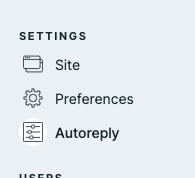
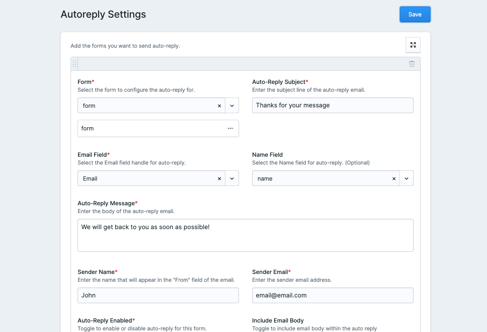
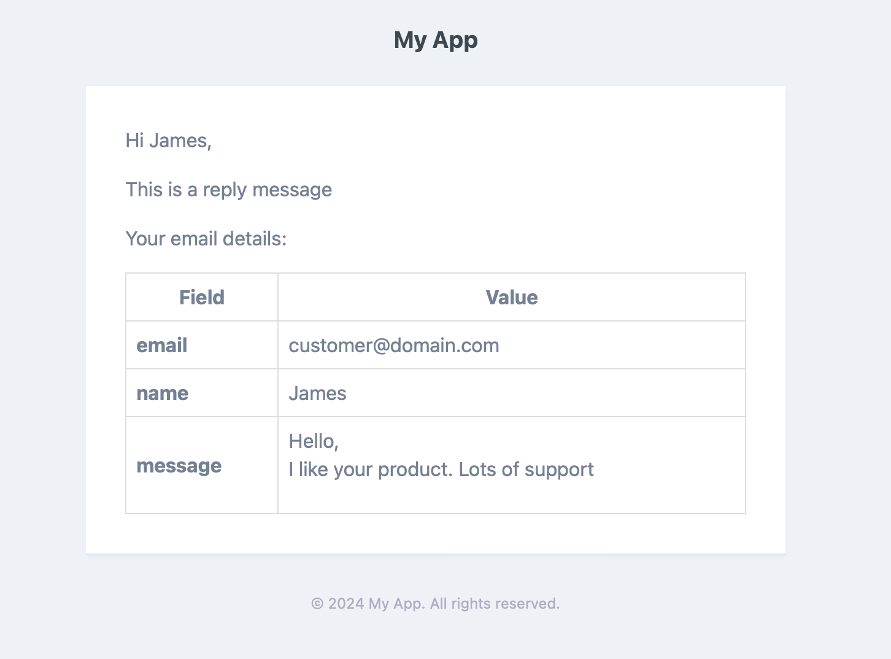

# Autoreply - Statamic Addon

The Autoreply addon enhances your Statamic forms by automatically sending customizable email replies to form submissions. It simplifies engagement with users by promptly acknowledging their submissions with personalized messages.

## Key Features

1. **Automatic Email Replies:** Automatically sends a reply to form submissions with a customizable message.
2. **Customizable Email Templates:** Allows users to personalize email templates using Markdown for a unique touch.
3. **Conditional Submission Number Inclusion:** Option to include the submission number in the email if configured.
4. **Attachment Support:** Supports attaching files to automatic reply emails.
5. **Support for Multiple Forms:** Configure automatic replies for multiple forms within your Statamic site.

## Screenshots






## Installation

To install the Autoreply addon, use Composer:

```bash
composer require thirtybittech/autoreply
```

Publish the addon assets and configuration if it has not already published.:

```bash
php artisan vendor:publish --tag=autoreply-config
```

If you wish to customize email views, publish them using:

```bash
php artisan vendor:publish --tag=autoreply-views
```

## Configuration

Configuration for Autoreply is located in `config/autoreply.php`. Customize settings here to tailor the addon to your needs. Ensure valid SMTP settings are configured in your Statamic environment for email functionality.

## Usage

1. Make sure SMTP is working.
2. Create a form in Statamic and configure it to use the Autoreply addon.
3. Add configuration for each form for auto reply.
4. Test the Autoreply functionality by submitting the form and verifying that the automatic email replies are sent as expected.